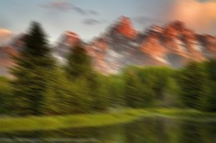
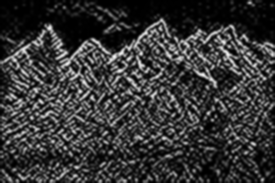
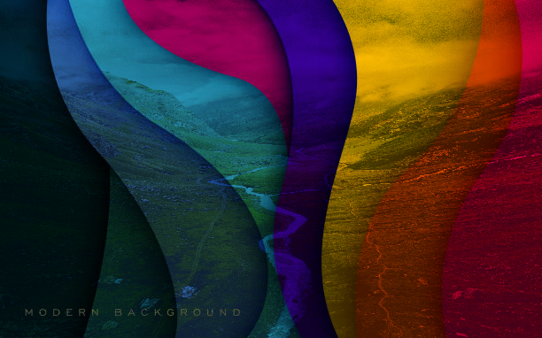

# Node-Based Image Manipulation Framework

This is a node-based image manipulation framework implemented in C++. The system allows users to apply various image processing operations through a modular, node-based structure. Each node represents an individual operation, such as applying filters, adjusting brightness and contrast, edge detection, and more. Nodes can be connected to form a flexible and customizable processing pipeline.

## Features

- **Modular Design**: Each image processing operation is encapsulated within its own node, which can be easily connected to other nodes.
- **Flexible Image Processing**: Includes nodes for image input/output, color channel manipulation, brightness/contrast adjustments, blurring, edge detection, thresholding, and more.
- **Graph-Based Workflow**: Nodes are organized and connected in a directed acyclic graph (DAG), which ensures efficient data flow and processing.
- **Easy Extension**: New nodes can be added to extend the functionality of the framework.

## Key Components

### Nodes

- **ImageInputNode**: Loads an image from the file system and provides it to the graph for processing.
- **OutputNode**: Saves the processed image to a file.
- **ColorChannelSplitterNode**: Splits an image into its individual RGB channels.
- **BrightnessContrastNode**: Adjusts the brightness and contrast of the image.
- **BlurNode**: Applies Gaussian or directional blur to the image.
- **ThresholdNode**: Converts the image to binary based on a thresholding method (binary, adaptive, Otsu).
- **EdgeDetectionNode**: Detects edges in the image using Sobel or Canny edge detection algorithms.
- **BlendNode**: Combines two images together using blending techniques.
- **NoiseGeneratorNode**: Adds noise to an image.
- **ConvolutionFilterNode**: Applies a convolution filter to an image.

### Image Processing Operations

1. **Image Input and Output**: Load and save images in various formats (JPEG, PNG, etc.).
2. **Color Channel Manipulation**: Split and merge image channels for individual processing.
3. **Brightness/Contrast Adjustment**: Modify the brightness and contrast of an image.
4. **Blurring**: Apply Gaussian or directional blur to the image.
5. **Edge Detection**: Detect edges using Sobel or Canny edge detection algorithms.
6. **Thresholding**: Convert the image into a binary image based on specified thresholding methods (e.g., Otsu's, binary, adaptive).
7. **Blending**: Blend two images together using configurable parameters.

## Example Images

### Original Image
Here is an example of the original image before any processing:


### Grayscale Image
After applying Directional Blur transformation:


### Edge Detection (Sobel)
Here is the result of edge detection using the Sobel algorithm:


### Edge Detection (Canny)
This is the result of Blend using multiply operation:


## Installation

### Prerequisites

- **C++11 or later**: The framework is implemented in C++ and requires at least C++11 to compile.
- **OpenCV**: The framework uses OpenCV for image processing tasks.
- **ImGui**: Used for the GUI elements to control the parameters of the nodes.

### Dependencies

1. OpenCV (for image processing)
2. ImGui (for the graphical interface)

### Building the Project

1. Clone the repository:

    ```bash
    git clone https://github.com/Pulkit-Sheoran-ux/Node-Based-Image-Manipulation.git
    ```

2. Install OpenCV and ImGui (either via package manager or build from source).
3. Create a `CMakeLists.txt` file for building the project.
4. Use CMake to generate the build files and then compile the project:

    ```bash
    cmake .
    make
    ```

5. Run the application:

    ```bash
    ./node-image-manipulation
    ```

## Usage

Once the application is running, you can interact with the following options:

1. **Load Image**: Load an image file for processing.
2. **Apply Operations**: Choose from a list of available image processing operations like brightness/contrast adjustment, edge detection, blur, and more.
3. **Save Output Image**: Save the processed image to your local file system.
4. **Merge Channels**: Merge the individual color channels back into a single image.
5. **Edge Detection**: Apply edge detection using Sobel or Canny.
6. **Thresholding**: Apply different thresholding methods to convert the image to a binary form.

## Example Workflow

Here’s an example of how the system works:

1. Load an image.
2. Apply a blur (Gaussian or directional).
3. Apply edge detection (Sobel or Canny).
4. Save the processed image.

## Future Enhancements

- **GUI Integration**: Add a graphical user interface for easier interaction with the system (e.g., using Qt).
- **Additional Image Processing Nodes**: Add more advanced nodes such as histogram equalization, image sharpening, and others.
- **Batch Processing**: Add functionality to process multiple images at once, for example, applying the same operations to a batch of images.

## License

This project is licensed under the MIT License - see the [LICENSE](LICENSE) file for details.

## Acknowledgments

- OpenCV: For providing a powerful library for image processing.
- ImGui: For enabling a simple and fast graphical user interface.

---

Feel free to modify or expand this README as necessary!

---

This README is designed to give users and developers a comprehensive overview of the project and how to use it effectively. It includes sections on installation, usage, key components, and potential future enhancements. You can adjust this content according to the specifics of your project and your personal preferences.
